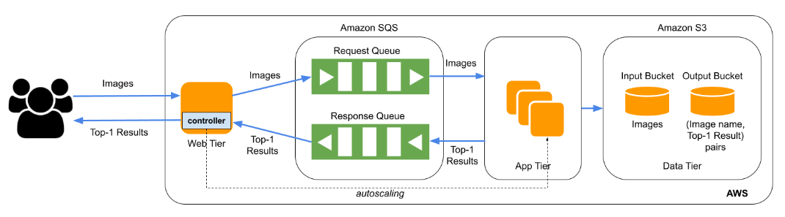
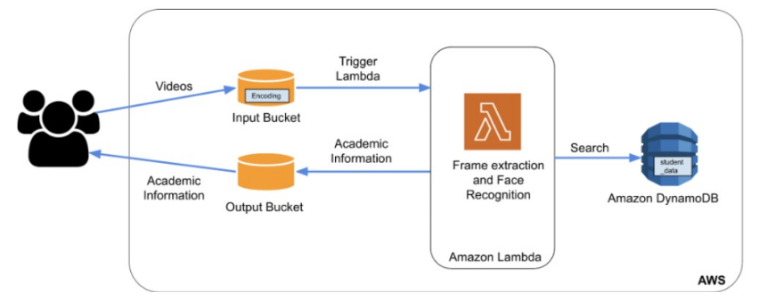

# Facial Recognition as a Service

## Project Description

The cloud app will provide facial recognition service to users, by using cloud resources to perform deep learning on images provided by the users. In the first project, an elastic application is built that can automatically scale in and out on-demand and cost-effectively by using the IaaS cloud. Specifically, we will build this application using the IaaS resources from Amazon Web Services (AWS).
The first version consists of an application on AWS EC2 developed using Java and Spring Boot that processes requests and auto-scales to provide a fast and efficient facial recognition service using a deep learning model.
The architecture consists of two main components namely Web Tier which is developed using Java and Spring Boot and the App Tier which is developed using Python.

Further, I built a serverless version of the application with some additional features using Paas Cloud. Specifically, this application is built using AWS Lambda and other supporting services from AWS. 
The cloud app will implement a smart classroom assistant for educators. This assistant takes videos from the user’s classroom, performs face recognition on the collected videos, looks up the recognized students in the database, and returns the relevant academic information of each student back to the user.

Below are the architectures for the two versions of the application: 

## Architecture 1 (AWS Iaas): 

## Architecture 2 (AWS Paas): 

## Components

a. Web Tier : 
A tomcat server that receives (listens) incoming post requests from users to upload photos makes up the web-tier. The server keeps the photos in SQS queues as input and puts them in S3 buckets as input for app-tier processing. Web-tier scales out the app-tier instances (maximum of 19) for quicker processing of the requests/images when the number of pictures
(msgs) in the SQS queue rises. In order to receive the results of face recognition, the Web-tier also polls the SQS queue (output) and provides the appropriate response. Each request is processed by the web-tier using multithreading, which spawns new threads and creates new instances of the app-tier.

b. App Tier : 
Face recognition in images is the responsibility of the App Tier. The web tier initiates the app tier to handle the input queue's images. As soon as the App Tier is launched, it polls a name from the input queue for an image. Additionally, the actual image is downloaded from the input S3 bucket. The face recognition Python script is then invoked for the image to receive the categorization, and the face recognition task is completed. Once the classification is complete, the output S3 bucket stores the name of the input image and the classification result as a key-value pair. Additionally, the output queue receives the input image and categorization for consumption. Finally, the app tier performs scaling down if it discovers any further photos in the queue. If not, it repeats the process above.

c. AWS EC2 : 
The App Tier and Web Tier of the application are hosted by the EC2 instance. The app-tier is in charge of processing the queued image names and downloading the corresponding images from the input bucket at S3 to produce the recognition results for the images. Additionally, in the context of the web tier, it is accountable for listening to incoming classification requests and sending them to the input queue, processing the request, managing app tier scaling, and returning the classification output by polling the response queue. The main service for this application and functionality is provided by this AWS service.

d. AWS SQS : 
A distributed queue offered by AWS services is called SQS, or Simple Queue Service. We are employing the FIFO SQS queue for this project. The order is upheld and a single request is processed by the FIFO SQS queue. In this project, we're using two FIFO SQS queues. The input queue, or queue of input (request) images, is the first. The Web Tier populates this. The classification result is stored in the second queue which is the response/output queue and is consumed by the web layer after being filled by the app tier.

e. AWS S3 : 
The AWS S3 or Simple Storage Service is a key-value store. It is used at two places in the project. The first S3 bucket (input bucket) is responsible for holding the image file name and the actual file. This is the place from where the app tier downloads the image for classification. Finally, the second S3 bucket (output bucket) holds the image name and classification result pair.
Further, in the serverless variant users upload videos to the input bucket stored in S3, and students’ academic information is stored as a file by the AWS Lambda function in the output bucket in S3.

f. AWS Lambda : 
The AWS Lambda function is triggered when a user uploads a video in S3. The lambda function performs facial recognition and uses the name of the first recognized face to search in DynamoDB for this person’s academic information. Finally, it stores the student information as a file in the output S3 bucket.

g. AWS DynamoDB : 
The DynamoDB is preloaded with student information and is queried by the Lambda function for fetching student information.
